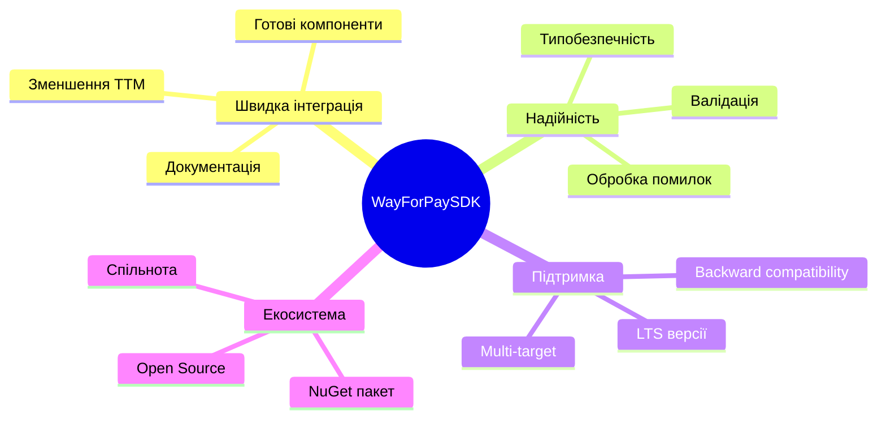
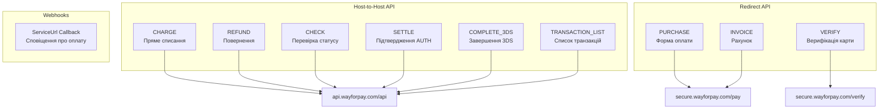
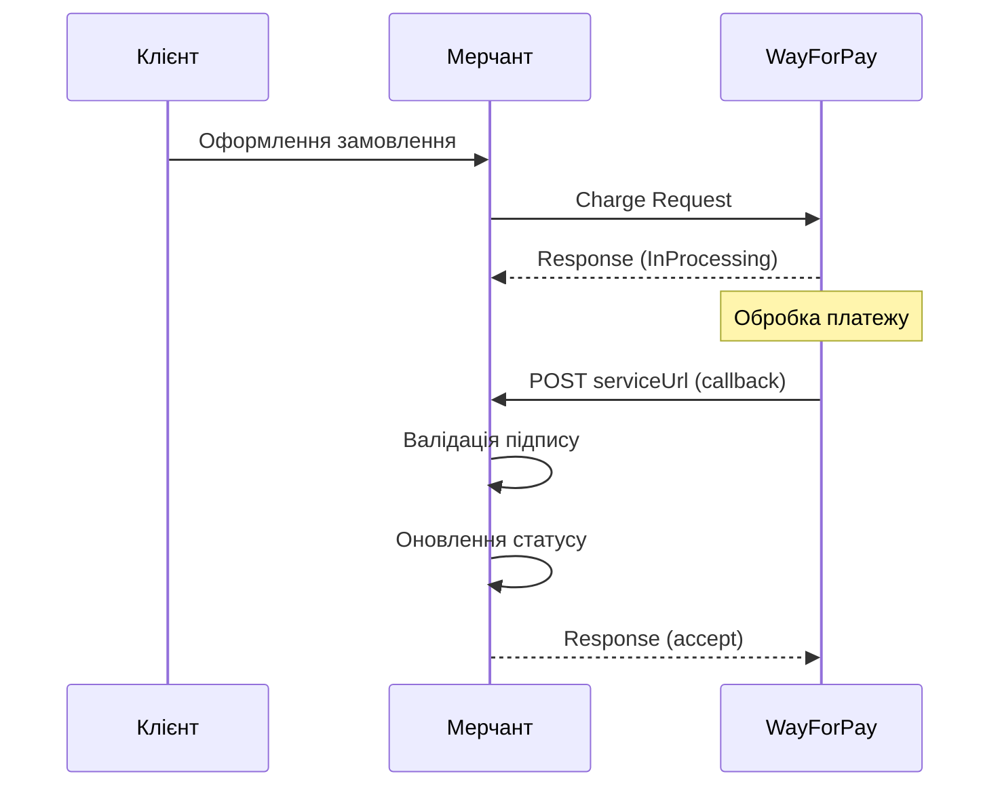
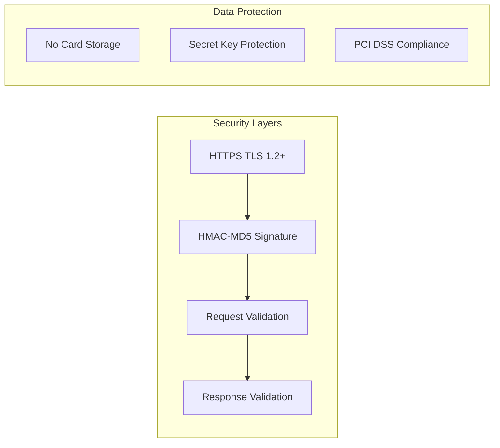
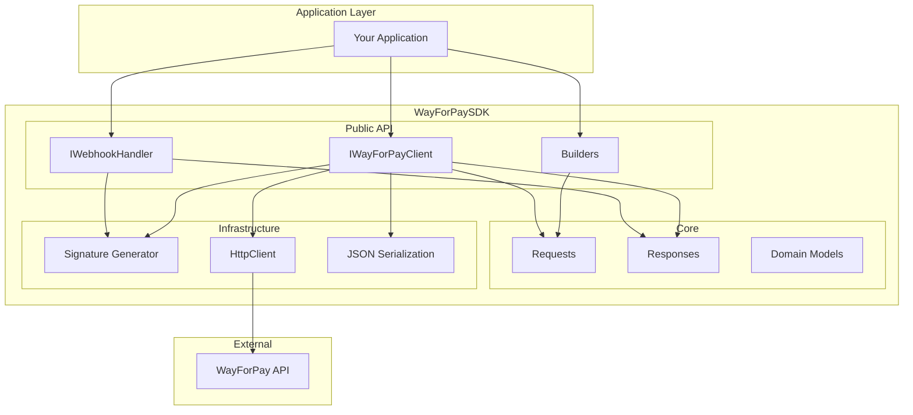
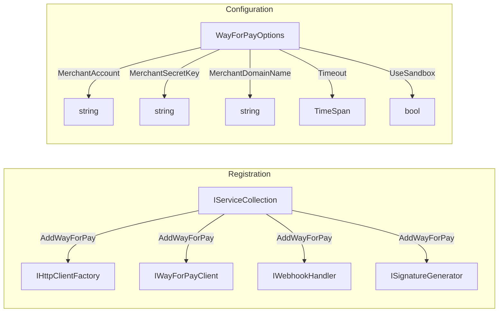
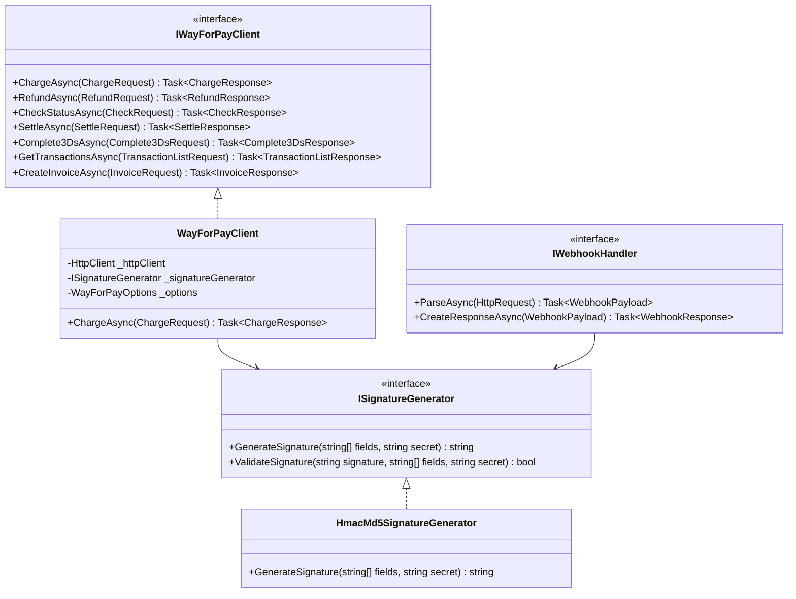
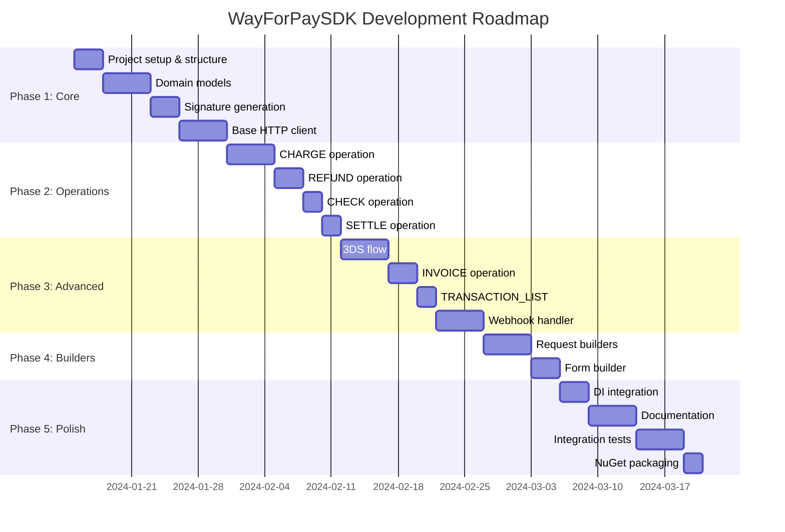

# Product Requirements Document (PRD)
## WayForPaySDK для .NET

**Версія документу:** 1.0
**Дата:** 08.01.2026
**Автор:** Business Analysis Team
**Статус:** Draft

---

## Зміст

1. [Executive Summary](#1-executive-summary)
2. [Цілі та задачі](#2-цілі-та-задачі)
3. [Функціональні вимоги](#3-функціональні-вимоги)
4. [Нефункціональні вимоги](#4-нефункціональні-вимоги)
5. [Архітектура SDK](#5-архітектура-sdk)
6. [Моделі даних](#6-моделі-даних)
7. [API Reference](#7-api-reference)
8. [Приклади використання](#8-приклади-використання)
9. [План реалізації](#9-план-реалізації)
10. [Тестування](#10-тестування)
11. [Залежності](#11-залежності)

---

## 1. Executive Summary

### 1.1 Огляд продукту

**WayForPaySDK** — це офіційний .NET SDK для інтеграції з платіжною системою WayForPay, провідним українським провайдером онлайн-платежів. SDK надає зручний, типобезпечний API для виконання всіх операцій з платежами: від простих покупок до складних сценаріїв з рекурентними платежами та 3D Secure.

### 1.2 Цінність продукту

| Аспект | Цінність |
|--------|----------|
| **Для розробників** | Зменшення часу інтеграції з тижнів до годин завдяки готовим компонентам |
| **Для бізнесу** | Швидкий вихід на ринок з платіжними рішеннями в Україні |
| **Для DevOps** | Стандартизована інтеграція через DI та IHttpClientFactory |
| **Для QA** | Тестовані компоненти з можливістю мокування |

### 1.3 Ключові характеристики

- **Повна підтримка WayForPay API** — всі 9 операцій платіжного шлюзу
- **Сучасний .NET** — async/await, nullable reference types, records
- **Multi-target** — підтримка .NET 6.0, 7.0, 8.0
- **Fluent API** — інтуїтивний Builder pattern для створення запитів
- **Безпека** — HMAC-MD5 підпис, відсутність зберігання чутливих даних
- **Тестованість** — абстракції та інтерфейси для unit-тестування

---

## 2. Цілі та задачі

### 2.1 Бізнес-цілі



### 2.2 Технічні цілі

| ID | Ціль | Метрика успіху |
|----|------|----------------|
| TG-01 | Повний паритет з PHP SDK | 100% операцій імплементовано |
| TG-02 | Продуктивність | < 50ms overhead на запит |
| TG-03 | Тестове покриття | > 80% code coverage |
| TG-04 | Документація | 100% public API задокументовано |
| TG-05 | Сумісність | Підтримка .NET 6, 7, 8 |

### 2.3 Проблеми, які вирішує SDK

1. **Відсутність офіційного .NET SDK** — розробники вимушені писати власні інтеграції
2. **Складність роботи з підписами** — HMAC-MD5 обчислення потребує точної імплементації
3. **Обробка webhook-ів** — валідація та парсинг колбеків від WayForPay
4. **3D Secure flow** — складна логіка з редиректами та підтвердженнями
5. **Recurring платежі** — управління токенами та розкладом

### 2.4 Цільова аудиторія

| Роль | Потреби | Як SDK допомагає |
|------|---------|------------------|
| Backend Developer | Швидка інтеграція платежів | Готовий клієнт з типами |
| Tech Lead | Надійне рішення | Тести, документація, підтримка |
| DevOps | Конфігурація та моніторинг | DI інтеграція, логування |
| Security Engineer | Безпечна обробка платежів | Підпис запитів, валідація |

---

## 3. Функціональні вимоги

### 3.1 Огляд операцій WayForPay



### 3.2 FR-01: Операція CHARGE (Пряме списання)

**Опис:** Виконання прямого списання коштів з карти клієнта (Host-to-Host).

**Endpoint:** `POST https://api.wayforpay.com/api`

#### Вхідні параметри

| Параметр | Тип | Обов'язковий | Опис |
|----------|-----|--------------|------|
| merchantAccount | string | Так | Ідентифікатор мерчанта |
| merchantDomainName | string | Так | Домен мерчанта |
| merchantTransactionType | enum | Ні | AUTO, SALE, AUTH |
| merchantTransactionSecureType | enum | Ні | AUTO, 3DS, NON3DS |
| orderReference | string | Так | Унікальний номер замовлення |
| orderDate | long | Так | Unix timestamp |
| amount | decimal | Так | Сума платежу |
| currency | string | Так | Валюта (UAH, USD, EUR) |
| card | string | Так* | Номер карти |
| expMonth | int | Так* | Місяць exp (1-12) |
| expYear | int | Так* | Рік exp |
| cvv | string | Так* | CVV код |
| cardHolder | string | Так* | Ім'я власника |
| recToken | string | Так* | Токен для рекурентного платежу |
| productName[] | string[] | Так | Назви товарів |
| productPrice[] | decimal[] | Так | Ціни товарів |
| productCount[] | int[] | Так | Кількість товарів |
| clientFirstName | string | Ні | Ім'я клієнта |
| clientLastName | string | Ні | Прізвище клієнта |
| clientEmail | string | Ні | Email клієнта |
| clientPhone | string | Ні | Телефон клієнта |
| clientCountry | string | Ні | Країна (ISO 3166-1 alpha-3) |
| clientIpAddress | string | Ні | IP адреса клієнта |
| serviceUrl | string | Ні | URL для callback |
| holdTimeout | int | Ні | Таймаут для AUTH (сек) |

> *Примітка: Або картові дані (card, expMonth, expYear, cvv, cardHolder), або recToken

#### Вихідні параметри (Response)

| Параметр | Тип | Опис |
|----------|-----|------|
| merchantAccount | string | Ідентифікатор мерчанта |
| orderReference | string | Номер замовлення |
| merchantSignature | string | Підпис відповіді |
| amount | decimal | Сума |
| currency | string | Валюта |
| authCode | string | Код авторизації банку |
| transactionStatus | string | Статус транзакції |
| reasonCode | int | Код результату |
| reason | string | Опис результату |
| cardPan | string | Маска карти (411111****1111) |
| cardType | string | Тип карти (Visa, MasterCard) |
| issuerBankCountry | string | Країна банку-емітента |
| issuerBankName | string | Назва банку-емітента |
| recToken | string | Токен для повторних платежів |
| fee | decimal | Комісія |
| paymentSystem | string | Платіжна система |

#### Статуси транзакції

| Статус | Опис |
|--------|------|
| Approved | Успішно оплачено |
| Pending | Очікує підтвердження |
| InProcessing | В обробці |
| WaitingAuthComplete | Очікує 3DS |
| Declined | Відхилено |
| Refunded | Повернено |
| Expired | Час вийшов |
| Voided | Скасовано |

#### Коди помилок (Reason Codes)

| Код | Опис |
|-----|------|
| 1100 | Ok (успішно) |
| 1101 | Invalid merchant data |
| 1102 | Invalid signature |
| 1104 | Insufficient funds |
| 1105 | Order already paid |
| 1108 | Invalid card data |
| 1109 | Invalid CVV |
| 1110 | Card expired |
| 1112 | 3DS required |
| 1130 | Transaction declined |
| 1131 | Merchant blocked |
| 1132 | Invalid amount |
| 1133 | Currency not allowed |

---

### 3.3 FR-02: Операція REFUND (Повернення)

**Опис:** Повне або часткове повернення коштів за раніше проведену транзакцію.

**Endpoint:** `POST https://api.wayforpay.com/api`

#### Вхідні параметри

| Параметр | Тип | Обов'язковий | Опис |
|----------|-----|--------------|------|
| merchantAccount | string | Так | Ідентифікатор мерчанта |
| orderReference | string | Так | Номер оригінального замовлення |
| amount | decimal | Так | Сума повернення |
| currency | string | Так | Валюта |
| comment | string | Ні | Причина повернення |

#### Вихідні параметри

| Параметр | Тип | Опис |
|----------|-----|------|
| merchantAccount | string | Ідентифікатор мерчанта |
| orderReference | string | Номер замовлення |
| transactionStatus | string | Статус (Refunded, Declined) |
| reasonCode | int | Код результату |
| reason | string | Опис результату |

---

### 3.4 FR-03: Операція CHECK (Перевірка статусу)

**Опис:** Перевірка поточного статусу замовлення/транзакції.

**Endpoint:** `POST https://api.wayforpay.com/api`

#### Вхідні параметри

| Параметр | Тип | Обов'язковий | Опис |
|----------|-----|--------------|------|
| merchantAccount | string | Так | Ідентифікатор мерчанта |
| orderReference | string | Так | Номер замовлення |

#### Вихідні параметри

Повна інформація про транзакцію (аналогічно CHARGE response).

---

### 3.5 FR-04: Операція SETTLE (Підтвердження AUTH)

**Опис:** Підтвердження та завершення попередньо авторизованого платежу (two-step payment).

**Endpoint:** `POST https://api.wayforpay.com/api`

#### Вхідні параметри

| Параметр | Тип | Обов'язковий | Опис |
|----------|-----|--------------|------|
| merchantAccount | string | Так | Ідентифікатор мерчанта |
| orderReference | string | Так | Номер замовлення |
| amount | decimal | Так | Сума (може бути <= AUTH суми) |
| currency | string | Так | Валюта |

#### Вихідні параметри

| Параметр | Тип | Опис |
|----------|-----|------|
| transactionStatus | string | Статус (Approved, Declined) |
| reasonCode | int | Код результату |
| reason | string | Опис |

---

### 3.6 FR-05: Операція COMPLETE_3DS (Завершення 3D Secure)

**Опис:** Завершення платежу після проходження 3D Secure автентифікації.

**Endpoint:** `POST https://api.wayforpay.com/api`

#### Вхідні параметри

| Параметр | Тип | Обов'язковий | Опис |
|----------|-----|--------------|------|
| merchantAccount | string | Так | Ідентифікатор мерчанта |
| d3ds_md | string | Так | MD параметр від 3DS |
| d3ds_pares | string | Так | PARes від ACS банку |

#### Вихідні параметри

Повна інформація про транзакцію (аналогічно CHARGE response).

---

### 3.7 FR-06: Операція TRANSACTION_LIST (Список транзакцій)

**Опис:** Отримання списку транзакцій за період.

**Endpoint:** `POST https://api.wayforpay.com/api`

#### Вхідні параметри

| Параметр | Тип | Обов'язковий | Опис |
|----------|-----|--------------|------|
| merchantAccount | string | Так | Ідентифікатор мерчанта |
| dateBegin | long | Так | Початок періоду (Unix timestamp) |
| dateEnd | long | Так | Кінець періоду (Unix timestamp) |

#### Вихідні параметри

| Параметр | Тип | Опис |
|----------|-----|------|
| transactionList | Transaction[] | Масив транзакцій |

---

### 3.8 FR-07: Операція INVOICE (Виставлення рахунку)

**Опис:** Створення рахунку для оплати та надсилання клієнту.

**Endpoint:** `POST https://api.wayforpay.com/api`

#### Вхідні параметри

| Параметр | Тип | Обов'язковий | Опис |
|----------|-----|--------------|------|
| merchantAccount | string | Так | Ідентифікатор мерчанта |
| merchantDomainName | string | Так | Домен мерчанта |
| orderReference | string | Так | Унікальний номер |
| orderDate | long | Так | Unix timestamp |
| amount | decimal | Так | Сума |
| currency | string | Так | Валюта |
| productName[] | string[] | Так | Назви товарів |
| productPrice[] | decimal[] | Так | Ціни |
| productCount[] | int[] | Так | Кількість |
| clientEmail | string | Так | Email для надсилання |
| clientPhone | string | Ні | Телефон клієнта |
| orderTimeout | int | Ні | Таймаут замовлення (сек) |
| orderLifetime | int | Ні | Час життя інвойсу (сек) |
| paymentSystems | string | Ні | Доступні способи оплати |
| language | string | Ні | Мова (UA, RU, EN) |

#### Вихідні параметри

| Параметр | Тип | Опис |
|----------|-----|------|
| invoiceUrl | string | URL для оплати |
| qrCode | string | QR код (base64) |
| reasonCode | int | Код результату |
| reason | string | Опис |

---

### 3.9 FR-08: Операція PURCHASE (Форма оплати)

**Опис:** Генерація HTML форми або даних для редиректу на платіжну сторінку.

**Endpoint:** `POST https://secure.wayforpay.com/pay`

#### Вхідні параметри

Аналогічно CHARGE, але без картових даних. Клієнт вводить дані на сторінці WayForPay.

#### Додаткові параметри

| Параметр | Тип | Опис |
|----------|-----|------|
| returnUrl | string | URL для повернення після оплати |
| language | string | Мова сторінки (AUTO, UA, RU, EN) |
| paymentSystems | string | Доступні способи оплати |
| defaultPaymentSystem | string | Спосіб оплати за замовчуванням |
| regularMode | string | Режим регулярного платежу |
| regularAmount | decimal | Сума регулярного платежу |
| dateNext | long | Дата наступного платежу |
| dateEnd | long | Дата закінчення підписки |
| regularCount | int | Кількість платежів |

---

### 3.10 FR-09: Операція VERIFY (Верифікація карти)

**Опис:** Перевірка карти без списання коштів (зазвичай списується і повертається 1 грн).

**Endpoint:** `POST https://secure.wayforpay.com/verify`

#### Вхідні параметри

Мінімальний набір для ідентифікації мерчанта та клієнта.

#### Вихідні параметри

| Параметр | Тип | Опис |
|----------|-----|------|
| recToken | string | Токен верифікованої карти |
| cardPan | string | Маска карти |
| transactionStatus | string | Статус верифікації |

---

### 3.11 FR-10: Webhook Handler (Обробка callback)

**Опис:** Обробка асинхронних сповіщень від WayForPay про статус платежу.



#### Структура callback

| Параметр | Тип | Опис |
|----------|-----|------|
| merchantAccount | string | Ідентифікатор мерчанта |
| orderReference | string | Номер замовлення |
| merchantSignature | string | Підпис для валідації |
| amount | decimal | Сума |
| currency | string | Валюта |
| authCode | string | Код авторизації |
| cardPan | string | Маска карти |
| transactionStatus | string | Фінальний статус |
| reasonCode | int | Код результату |
| reason | string | Опис |
| fee | decimal | Комісія |
| paymentSystem | string | Платіжна система |

#### Response на callback

```json
{
  "orderReference": "ORDER123",
  "status": "accept",
  "time": 1704700000,
  "signature": "..."
}
```

---

### 3.12 FR-11: Платіжні системи

SDK повинен підтримувати всі платіжні системи WayForPay:

| ID | Назва | Опис |
|----|-------|------|
| card | Банківська карта | Visa, MasterCard |
| privat24 | Приват24 | Онлайн-банкінг |
| applePay | Apple Pay | Mobile wallet |
| googlePay | Google Pay | Mobile wallet |
| masterPass | Masterpass | Digital wallet |
| visaCheckout | Visa Checkout | Digital wallet |
| payParts | Оплата частинами | Банківська розстрочка |
| payPartsMono | Покупка частинами monobank | Розстрочка від monobank |
| credit | Кредит | Кредитування |
| qrCode | QR-код | Оплата через QR |

---

### 3.13 FR-12: Recurring Payments (Регулярні платежі)

**Опис:** Підтримка автоматичних періодичних платежів.

#### Режими регулярних платежів

| Режим | Опис |
|-------|------|
| daily | Щоденно |
| weekly | Щотижня |
| monthly | Щомісяця |
| quarterly | Щоквартально |
| halfyearly | Раз на півроку |
| yearly | Щорічно |
| client | За запитом клієнта |

#### Параметри налаштування

| Параметр | Тип | Опис |
|----------|-----|------|
| regularMode | string[] | Доступні режими |
| regularAmount | decimal | Сума |
| dateNext | DateTime | Наступний платіж |
| dateEnd | DateTime | Дата закінчення |
| regularCount | int | Кількість платежів |
| regularOn | bool | Активність |

---

## 4. Нефункціональні вимоги

### 4.1 NFR-01: Продуктивність

| Метрика | Вимога |
|---------|--------|
| SDK overhead | < 50ms на запит |
| Memory footprint | < 10MB базове споживання |
| Connection pooling | Через IHttpClientFactory |
| Concurrent requests | Thread-safe operations |

### 4.2 NFR-02: Безпека



| Вимога | Опис |
|--------|------|
| Транспорт | HTTPS з TLS 1.2+ |
| Автентифікація | HMAC-MD5 підпис кожного запиту |
| Валідація | Перевірка підпису відповідей |
| Картові дані | Заборона зберігання (PCI DSS) |
| Логування | Маскування sensitive data |

### 4.3 NFR-03: Надійність

| Аспект | Вимога |
|--------|--------|
| Retry policy | Configurable retry з exponential backoff |
| Timeout | Configurable (default 30s) |
| Circuit breaker | Опціональна підтримка Polly |
| Graceful degradation | Чіткі exception types |

### 4.4 NFR-04: Підтримуваність

| Аспект | Вимога |
|--------|--------|
| Код | C# 10+ features |
| Стиль | .NET coding conventions |
| Документація | XML docs для IntelliSense |
| Версіонування | Semantic Versioning |

### 4.5 NFR-05: Сумісність

| Framework | Підтримка |
|-----------|-----------|
| .NET 6.0 | LTS (до Nov 2024) |
| .NET 7.0 | Standard (до May 2024) |
| .NET 8.0 | LTS (до Nov 2026) |
| .NET 9.0 | Planned |

### 4.6 NFR-06: Тестованість

| Вимога | Опис |
|--------|------|
| Interfaces | Всі залежності через інтерфейси |
| DI | IServiceCollection extension |
| Mocking | HttpMessageHandler заміщуваний |
| Test mode | Sandbox environment support |

---

## 5. Архітектура SDK

### 5.1 Namespace структура

```
WayForPaySDK/
├── WayForPaySDK/
│   ├── Client/
│   │   ├── IWayForPayClient.cs
│   │   ├── WayForPayClient.cs
│   │   └── WayForPayClientOptions.cs
│   │
│   ├── Credentials/
│   │   ├── IMerchantCredentials.cs
│   │   ├── MerchantSecretCredentials.cs
│   │   └── MerchantPasswordCredentials.cs
│   │
│   ├── Domain/
│   │   ├── Card.cs
│   │   ├── CardToken.cs
│   │   ├── Client.cs
│   │   ├── Product.cs
│   │   ├── Transaction.cs
│   │   ├── TransactionBase.cs
│   │   ├── Reason.cs
│   │   ├── Regular.cs
│   │   └── PaymentSystems.cs
│   │
│   ├── Requests/
│   │   ├── ChargeRequest.cs
│   │   ├── RefundRequest.cs
│   │   ├── CheckRequest.cs
│   │   ├── SettleRequest.cs
│   │   ├── Complete3DsRequest.cs
│   │   ├── TransactionListRequest.cs
│   │   ├── InvoiceRequest.cs
│   │   ├── PurchaseRequest.cs
│   │   └── VerifyRequest.cs
│   │
│   ├── Responses/
│   │   ├── IWayForPayResponse.cs
│   │   ├── ChargeResponse.cs
│   │   ├── RefundResponse.cs
│   │   ├── CheckResponse.cs
│   │   ├── SettleResponse.cs
│   │   ├── Complete3DsResponse.cs
│   │   ├── TransactionListResponse.cs
│   │   ├── InvoiceResponse.cs
│   │   └── VerifyResponse.cs
│   │
│   ├── Builders/
│   │   ├── ChargeRequestBuilder.cs
│   │   ├── RefundRequestBuilder.cs
│   │   ├── InvoiceRequestBuilder.cs
│   │   ├── PurchaseFormBuilder.cs
│   │   └── ...
│   │
│   ├── Handlers/
│   │   ├── IWebhookHandler.cs
│   │   ├── WebhookHandler.cs
│   │   └── WebhookResponse.cs
│   │
│   ├── Crypto/
│   │   ├── ISignatureGenerator.cs
│   │   ├── HmacMd5SignatureGenerator.cs
│   │   └── SignatureValidator.cs
│   │
│   ├── Exceptions/
│   │   ├── WayForPayException.cs
│   │   ├── ApiException.cs
│   │   ├── SignatureException.cs
│   │   ├── ValidationException.cs
│   │   └── TimeoutException.cs
│   │
│   ├── Extensions/
│   │   ├── ServiceCollectionExtensions.cs
│   │   └── HttpClientBuilderExtensions.cs
│   │
│   ├── Constants/
│   │   ├── Endpoints.cs
│   │   ├── TransactionTypes.cs
│   │   ├── TransactionStatuses.cs
│   │   ├── ReasonCodes.cs
│   │   └── Currencies.cs
│   │
│   └── Serialization/
│       ├── WayForPayJsonContext.cs
│       └── DateTimeConverter.cs
```

### 5.2 Діаграма компонентів



### 5.3 Dependency Injection



---

## 6. Моделі даних

### 6.1 Domain Models

#### Card

```csharp
/// <summary>
/// Представляє дані банківської карти для оплати
/// </summary>
public sealed record Card
{
    /// <summary>Номер карти (16 цифр)</summary>
    public required string Number { get; init; }

    /// <summary>Місяць закінчення терміну дії (1-12)</summary>
    public required int ExpireMonth { get; init; }

    /// <summary>Рік закінчення терміну дії (4 цифри)</summary>
    public required int ExpireYear { get; init; }

    /// <summary>CVV/CVC код (3-4 цифри)</summary>
    public required string Cvv { get; init; }

    /// <summary>Ім'я власника карти латиницею</summary>
    public required string Holder { get; init; }
}
```

#### CardToken

```csharp
/// <summary>
/// Токен карти для рекурентних платежів
/// </summary>
public sealed record CardToken
{
    /// <summary>Токен для повторних списань</summary>
    public required string Token { get; init; }

    /// <summary>Маскований номер карти</summary>
    public string? CardPan { get; init; }

    /// <summary>Тип карти (Visa, MasterCard)</summary>
    public string? CardType { get; init; }
}
```

#### Client

```csharp
/// <summary>
/// Інформація про клієнта/покупця
/// </summary>
public sealed record Client
{
    /// <summary>Ідентифікатор клієнта в системі мерчанта</summary>
    public string? AccountId { get; init; }

    /// <summary>Ім'я клієнта</summary>
    public required string FirstName { get; init; }

    /// <summary>Прізвище клієнта</summary>
    public required string LastName { get; init; }

    /// <summary>Email клієнта</summary>
    public required string Email { get; init; }

    /// <summary>Телефон у міжнародному форматі</summary>
    public required string Phone { get; init; }

    /// <summary>Країна (ISO 3166-1 alpha-3)</summary>
    public string? Country { get; init; }

    /// <summary>IP адреса клієнта</summary>
    public string? IpAddress { get; init; }

    /// <summary>Адреса доставки</summary>
    public string? Address { get; init; }

    /// <summary>Місто</summary>
    public string? City { get; init; }

    /// <summary>Область/Штат</summary>
    public string? State { get; init; }

    /// <summary>Поштовий індекс</summary>
    public string? ZipCode { get; init; }
}
```

#### Product

```csharp
/// <summary>
/// Товар або послуга в замовленні
/// </summary>
public sealed record Product
{
    /// <summary>Назва товару</summary>
    public required string Name { get; init; }

    /// <summary>Ціна за одиницю</summary>
    public required decimal Price { get; init; }

    /// <summary>Кількість</summary>
    public required int Count { get; init; }
}
```

#### Transaction

```csharp
/// <summary>
/// Повна інформація про транзакцію
/// </summary>
public sealed record Transaction
{
    // Основна інформація
    public required string OrderReference { get; init; }
    public required decimal Amount { get; init; }
    public required string Currency { get; init; }
    public required string TransactionStatus { get; init; }
    public required string MerchantTransactionType { get; init; }

    // Часові мітки
    public required DateTimeOffset CreatedDate { get; init; }
    public DateTimeOffset? ProcessingDate { get; init; }

    // Результат
    public required int ReasonCode { get; init; }
    public required string Reason { get; init; }

    // Банківські дані
    public string? AuthCode { get; init; }
    public string? AuthTicket { get; init; }

    // Картові дані
    public string? CardPan { get; init; }
    public string? CardType { get; init; }
    public string? IssuerBankCountry { get; init; }
    public string? IssuerBankName { get; init; }

    // Рекурентні платежі
    public CardToken? RecToken { get; init; }

    // 3D Secure
    public string? D3AcsUrl { get; init; }
    public string? D3Md { get; init; }
    public string? D3Pareq { get; init; }

    // Клієнт
    public string? Email { get; init; }
    public string? Phone { get; init; }

    // Фінанси
    public string? PaymentSystem { get; init; }
    public decimal? Fee { get; init; }
    public decimal? BaseAmount { get; init; }
    public string? BaseCurrency { get; init; }

    // Повернення
    public string? ReturnUrl { get; init; }
}
```

#### Reason

```csharp
/// <summary>
/// Результат операції WayForPay
/// </summary>
public sealed record Reason
{
    public required int Code { get; init; }
    public required string Message { get; init; }

    /// <summary>Операція успішна</summary>
    public bool IsSuccess => Code == ReasonCodes.Ok;

    /// <summary>Потрібна 3DS автентифікація</summary>
    public bool Is3DsRequired => Code == ReasonCodes.Waiting3Ds;

    /// <summary>Операція в обробці</summary>
    public bool IsPending => Code == ReasonCodes.InProcessing;
}
```

#### PaymentSystems

```csharp
/// <summary>
/// Доступні платіжні системи
/// </summary>
[Flags]
public enum PaymentSystem
{
    None = 0,
    Card = 1 << 0,
    Privat24 = 1 << 1,
    ApplePay = 1 << 2,
    GooglePay = 1 << 3,
    MasterPass = 1 << 4,
    VisaCheckout = 1 << 5,
    PayParts = 1 << 6,
    PayPartsMono = 1 << 7,
    Credit = 1 << 8,
    QrCode = 1 << 9,

    All = Card | Privat24 | ApplePay | GooglePay | MasterPass |
          VisaCheckout | PayParts | PayPartsMono | Credit | QrCode
}
```

#### Regular

```csharp
/// <summary>
/// Налаштування регулярних платежів
/// </summary>
public sealed record RegularPaymentSettings
{
    /// <summary>Доступні режими періодичності</summary>
    public required RegularMode[] Modes { get; init; }

    /// <summary>Сума регулярного платежу</summary>
    public required decimal Amount { get; init; }

    /// <summary>Дата наступного платежу</summary>
    public required DateTimeOffset DateNext { get; init; }

    /// <summary>Дата закінчення (альтернатива Count)</summary>
    public DateTimeOffset? DateEnd { get; init; }

    /// <summary>Кількість платежів (альтернатива DateEnd)</summary>
    public int? Count { get; init; }

    /// <summary>Регулярний платіж активний</summary>
    public bool IsActive { get; init; } = true;
}

public enum RegularMode
{
    Once,
    Daily,
    Weekly,
    Monthly,
    Quarterly,
    Halfyearly,
    Yearly,
    Client
}
```

### 6.2 Request Models

#### ChargeRequest

```csharp
public sealed record ChargeRequest
{
    // Merchant
    public required string MerchantAccount { get; init; }
    public required string MerchantDomainName { get; init; }
    public string MerchantAuthType { get; init; } = "SimpleSignature";
    public TransactionType MerchantTransactionType { get; init; } = TransactionType.Auto;
    public SecureType MerchantTransactionSecureType { get; init; } = SecureType.Auto;

    // Order
    public required string OrderReference { get; init; }
    public required DateTimeOffset OrderDate { get; init; }
    public required decimal Amount { get; init; }
    public required string Currency { get; init; }

    // Products
    public required IReadOnlyList<Product> Products { get; init; }

    // Payment method (one of)
    public Card? Card { get; init; }
    public string? RecToken { get; init; }

    // Client (optional)
    public Client? Client { get; init; }

    // Callbacks
    public string? ServiceUrl { get; init; }
    public string? ReturnUrl { get; init; }

    // AUTH timeout
    public int? HoldTimeout { get; init; }

    // Social
    public string? SocialUri { get; init; }
}

public enum TransactionType
{
    Auto,
    Sale,
    Auth
}

public enum SecureType
{
    Auto,
    ThreeDs,
    NonThreeDs
}
```

### 6.3 Response Models

#### ChargeResponse

```csharp
public sealed record ChargeResponse : IWayForPayResponse
{
    public required string MerchantAccount { get; init; }
    public required string MerchantSignature { get; init; }
    public required Transaction Transaction { get; init; }
    public required Reason Reason { get; init; }

    public bool IsSuccess => Reason.IsSuccess;
    public bool Requires3Ds => Reason.Is3DsRequired;
}
```

### 6.4 Діаграма класів



---

## 7. API Reference

### 7.1 IWayForPayClient Interface

```csharp
/// <summary>
/// Головний клієнт для взаємодії з WayForPay API
/// </summary>
public interface IWayForPayClient
{
    /// <summary>
    /// Виконує пряме списання коштів з карти
    /// </summary>
    /// <param name="request">Параметри платежу</param>
    /// <param name="cancellationToken">Токен скасування</param>
    /// <returns>Результат операції списання</returns>
    Task<ChargeResponse> ChargeAsync(
        ChargeRequest request,
        CancellationToken cancellationToken = default);

    /// <summary>
    /// Повертає кошти за попередню транзакцію
    /// </summary>
    Task<RefundResponse> RefundAsync(
        RefundRequest request,
        CancellationToken cancellationToken = default);

    /// <summary>
    /// Перевіряє статус замовлення
    /// </summary>
    Task<CheckResponse> CheckStatusAsync(
        CheckRequest request,
        CancellationToken cancellationToken = default);

    /// <summary>
    /// Підтверджує попередньо авторизований платіж
    /// </summary>
    Task<SettleResponse> SettleAsync(
        SettleRequest request,
        CancellationToken cancellationToken = default);

    /// <summary>
    /// Завершує 3D Secure автентифікацію
    /// </summary>
    Task<Complete3DsResponse> Complete3DsAsync(
        Complete3DsRequest request,
        CancellationToken cancellationToken = default);

    /// <summary>
    /// Отримує список транзакцій за період
    /// </summary>
    Task<TransactionListResponse> GetTransactionsAsync(
        TransactionListRequest request,
        CancellationToken cancellationToken = default);

    /// <summary>
    /// Створює інвойс для оплати
    /// </summary>
    Task<InvoiceResponse> CreateInvoiceAsync(
        InvoiceRequest request,
        CancellationToken cancellationToken = default);
}
```

### 7.2 Builder Pattern API

```csharp
/// <summary>
/// Fluent builder для створення ChargeRequest
/// </summary>
public interface IChargeRequestBuilder
{
    IChargeRequestBuilder WithOrderReference(string orderReference);
    IChargeRequestBuilder WithAmount(decimal amount, string currency = "UAH");
    IChargeRequestBuilder WithProducts(params Product[] products);
    IChargeRequestBuilder WithCard(Card card);
    IChargeRequestBuilder WithRecToken(string recToken);
    IChargeRequestBuilder WithClient(Client client);
    IChargeRequestBuilder WithServiceUrl(string serviceUrl);
    IChargeRequestBuilder WithReturnUrl(string returnUrl);
    IChargeRequestBuilder WithHoldTimeout(int seconds);
    IChargeRequestBuilder AsAuth();
    IChargeRequestBuilder AsSale();
    IChargeRequestBuilder With3DS();
    IChargeRequestBuilder Without3DS();

    ChargeRequest Build();
}
```

### 7.3 Webhook Handler API

```csharp
/// <summary>
/// Обробник webhook сповіщень від WayForPay
/// </summary>
public interface IWebhookHandler
{
    /// <summary>
    /// Парсить та валідує вхідний webhook
    /// </summary>
    /// <param name="request">HTTP запит з webhook</param>
    /// <returns>Розпарсені дані платежу</returns>
    /// <exception cref="SignatureException">Невалідний підпис</exception>
    Task<WebhookPayload> ParseAsync(HttpRequest request);

    /// <summary>
    /// Створює підписану відповідь для WayForPay
    /// </summary>
    /// <param name="payload">Дані з webhook</param>
    /// <param name="status">Статус обробки</param>
    /// <returns>Відповідь для надсилання</returns>
    WebhookResponse CreateResponse(
        WebhookPayload payload,
        WebhookStatus status = WebhookStatus.Accept);
}

public enum WebhookStatus
{
    Accept,
    Decline
}
```

### 7.4 DI Extension Methods

```csharp
public static class ServiceCollectionExtensions
{
    /// <summary>
    /// Реєструє WayForPaySDK сервіси
    /// </summary>
    public static IServiceCollection AddWayForPay(
        this IServiceCollection services,
        Action<WayForPayOptions> configure)
    {
        services.Configure(configure);
        services.AddHttpClient<IWayForPayClient, WayForPayClient>();
        services.AddSingleton<ISignatureGenerator, HmacMd5SignatureGenerator>();
        services.AddScoped<IWebhookHandler, WebhookHandler>();
        return services;
    }

    /// <summary>
    /// Реєструє WayForPaySDK з конфігурацією з IConfiguration
    /// </summary>
    public static IServiceCollection AddWayForPay(
        this IServiceCollection services,
        IConfiguration configuration)
    {
        services.Configure<WayForPayOptions>(
            configuration.GetSection("WayForPay"));
        // ...
        return services;
    }
}
```

---

## 8. Приклади використання

### 8.1 Базова конфігурація

```csharp
// Program.cs
var builder = WebApplication.CreateBuilder(args);

builder.Services.AddWayForPay(options =>
{
    options.MerchantAccount = "merchant_account";
    options.MerchantSecretKey = "merchant_secret_key";
    options.MerchantDomainName = "example.com";
    options.Timeout = TimeSpan.FromSeconds(30);
    options.UseSandbox = builder.Environment.IsDevelopment();
});

var app = builder.Build();
```

### 8.2 Пряме списання (CHARGE)

```csharp
public class PaymentService
{
    private readonly IWayForPayClient _client;

    public PaymentService(IWayForPayClient client)
    {
        _client = client;
    }

    public async Task<PaymentResult> ProcessPaymentAsync(
        Order order,
        CardDetails cardDetails)
    {
        var request = new ChargeRequest
        {
            MerchantAccount = "my_merchant",
            MerchantDomainName = "myshop.com",
            OrderReference = order.Id.ToString(),
            OrderDate = DateTimeOffset.UtcNow,
            Amount = order.Total,
            Currency = "UAH",
            Products = order.Items.Select(i => new Product
            {
                Name = i.ProductName,
                Price = i.Price,
                Count = i.Quantity
            }).ToList(),
            Card = new Card
            {
                Number = cardDetails.Number,
                ExpireMonth = cardDetails.ExpMonth,
                ExpireYear = cardDetails.ExpYear,
                Cvv = cardDetails.Cvv,
                Holder = cardDetails.Holder
            },
            Client = new Client
            {
                FirstName = order.Customer.FirstName,
                LastName = order.Customer.LastName,
                Email = order.Customer.Email,
                Phone = order.Customer.Phone
            },
            ServiceUrl = "https://myshop.com/api/payment/callback"
        };

        var response = await _client.ChargeAsync(request);

        if (response.IsSuccess)
        {
            return PaymentResult.Success(response.Transaction);
        }

        if (response.Requires3Ds)
        {
            return PaymentResult.Requires3Ds(
                response.Transaction.D3AcsUrl!,
                response.Transaction.D3Md!,
                response.Transaction.D3Pareq!);
        }

        return PaymentResult.Failed(response.Reason);
    }
}
```

### 8.3 Використання Builder

```csharp
public async Task<ChargeResponse> ChargeWithBuilderAsync()
{
    var request = ChargeRequestBuilder.Create()
        .WithOrderReference(Guid.NewGuid().ToString())
        .WithAmount(100.00m, "UAH")
        .WithProducts(
            new Product { Name = "Product 1", Price = 50.00m, Count = 1 },
            new Product { Name = "Product 2", Price = 50.00m, Count = 1 })
        .WithCard(new Card
        {
            Number = "4111111111111111",
            ExpireMonth = 12,
            ExpireYear = 2025,
            Cvv = "123",
            Holder = "JOHN DOE"
        })
        .WithClient(new Client
        {
            FirstName = "John",
            LastName = "Doe",
            Email = "john@example.com",
            Phone = "+380991234567"
        })
        .WithServiceUrl("https://myshop.com/webhook")
        .AsSale()
        .With3DS()
        .Build();

    return await _client.ChargeAsync(request);
}
```

### 8.4 Повернення коштів (REFUND)

```csharp
public async Task<RefundResponse> RefundOrderAsync(
    string orderReference,
    decimal amount,
    string reason)
{
    var request = new RefundRequest
    {
        MerchantAccount = _options.MerchantAccount,
        OrderReference = orderReference,
        Amount = amount,
        Currency = "UAH",
        Comment = reason
    };

    return await _client.RefundAsync(request);
}
```

### 8.5 Обробка Webhook

```csharp
[ApiController]
[Route("api/payment")]
public class PaymentWebhookController : ControllerBase
{
    private readonly IWebhookHandler _webhookHandler;
    private readonly IOrderService _orderService;

    public PaymentWebhookController(
        IWebhookHandler webhookHandler,
        IOrderService orderService)
    {
        _webhookHandler = webhookHandler;
        _orderService = orderService;
    }

    [HttpPost("callback")]
    public async Task<IActionResult> HandleWebhook()
    {
        try
        {
            var payload = await _webhookHandler.ParseAsync(Request);

            await _orderService.UpdateOrderStatusAsync(
                payload.OrderReference,
                payload.TransactionStatus);

            var response = _webhookHandler.CreateResponse(
                payload,
                WebhookStatus.Accept);

            return Ok(response);
        }
        catch (SignatureException)
        {
            return BadRequest("Invalid signature");
        }
    }
}
```

### 8.6 3D Secure Flow

```csharp
public class ThreeDsService
{
    private readonly IWayForPayClient _client;

    public async Task<Complete3DsResponse> Complete3DsAsync(
        string md,
        string paRes)
    {
        var request = new Complete3DsRequest
        {
            MerchantAccount = _options.MerchantAccount,
            D3dsMd = md,
            D3dsPares = paRes
        };

        return await _client.Complete3DsAsync(request);
    }
}

// Razor Page для 3DS редиректу
@model ThreeDsModel

<form id="acsForm" method="post" action="@Model.AcsUrl">
    <input type="hidden" name="MD" value="@Model.Md" />
    <input type="hidden" name="PaReq" value="@Model.PaReq" />
    <input type="hidden" name="TermUrl" value="@Model.TermUrl" />
</form>

<script>
    document.getElementById('acsForm').submit();
</script>
```

### 8.7 Регулярні платежі

```csharp
public async Task<ChargeResponse> SetupSubscriptionAsync(
    Order order,
    Card card)
{
    var request = PurchaseRequestBuilder.Create()
        .WithOrderReference(order.Id.ToString())
        .WithAmount(order.SubscriptionPrice, "UAH")
        .WithProducts(new Product
        {
            Name = order.SubscriptionName,
            Price = order.SubscriptionPrice,
            Count = 1
        })
        .WithCard(card)
        .WithRegularPayment(new RegularPaymentSettings
        {
            Modes = [RegularMode.Monthly],
            Amount = order.SubscriptionPrice,
            DateNext = DateTimeOffset.UtcNow.AddMonths(1),
            Count = 12,
            IsActive = true
        })
        .Build();

    var response = await _client.ChargeAsync(request);

    if (response.IsSuccess && response.Transaction.RecToken != null)
    {
        // Зберегти токен для майбутніх списань
        await SaveRecTokenAsync(
            order.CustomerId,
            response.Transaction.RecToken);
    }

    return response;
}
```

### 8.8 Генерація форми оплати

```csharp
public class PurchaseFormService
{
    private readonly IPurchaseFormBuilder _formBuilder;

    public PurchaseFormHtml GeneratePaymentForm(Order order)
    {
        return _formBuilder
            .WithOrderReference(order.Id.ToString())
            .WithAmount(order.Total, "UAH")
            .WithProducts(order.Items.Select(i => new Product
            {
                Name = i.Name,
                Price = i.Price,
                Count = i.Quantity
            }).ToArray())
            .WithReturnUrl("https://myshop.com/payment/success")
            .WithServiceUrl("https://myshop.com/api/payment/callback")
            .WithLanguage("UA")
            .WithPaymentSystems(
                PaymentSystem.Card |
                PaymentSystem.GooglePay |
                PaymentSystem.ApplePay)
            .BuildHtmlForm();
    }
}
```

### 8.9 Використання з Minimal API

```csharp
var builder = WebApplication.CreateBuilder(args);

builder.Services.AddWayForPay(builder.Configuration);

var app = builder.Build();

app.MapPost("/api/charge", async (
    ChargeRequest request,
    IWayForPayClient client) =>
{
    var response = await client.ChargeAsync(request);
    return response.IsSuccess
        ? Results.Ok(response)
        : Results.BadRequest(response.Reason);
});

app.MapPost("/api/webhook", async (
    HttpRequest request,
    IWebhookHandler handler,
    IOrderService orders) =>
{
    var payload = await handler.ParseAsync(request);
    await orders.UpdateStatusAsync(payload.OrderReference, payload.TransactionStatus);
    return Results.Ok(handler.CreateResponse(payload));
});

app.Run();
```

---

## 9. План реалізації

### 9.1 Фази розробки



### 9.2 Фаза 1: Базова інфраструктура (2 тижні)

| Задача | Опис | Критерії готовності |
|--------|------|---------------------|
| P1-01 | Налаштування проекту | Multi-target csproj, NuGet metadata |
| P1-02 | Domain models | Всі 10+ моделей з валідацією |
| P1-03 | Constants | Endpoints, статуси, коди помилок |
| P1-04 | Signature generator | HMAC-MD5 з тестами |
| P1-05 | HTTP client base | IHttpClientFactory інтеграція |
| P1-06 | JSON serialization | Source generators, date handling |
| P1-07 | Exception hierarchy | 5 типів виключень |

### 9.3 Фаза 2: Основні операції (2 тижні)

| Задача | Опис | Критерії готовності |
|--------|------|---------------------|
| P2-01 | CHARGE request/response | Повний flow з картою та токеном |
| P2-02 | REFUND operation | Повне та часткове повернення |
| P2-03 | CHECK_STATUS | Перевірка статусу замовлення |
| P2-04 | SETTLE | Two-step payment підтвердження |
| P2-05 | Unit tests | >80% покриття фази |

### 9.4 Фаза 3: Розширені операції (2 тижні)

| Задача | Опис | Критерії готовності |
|--------|------|---------------------|
| P3-01 | COMPLETE_3DS | 3D Secure flow |
| P3-02 | INVOICE | Створення рахунків |
| P3-03 | TRANSACTION_LIST | Пагінація, фільтри |
| P3-04 | VERIFY | Верифікація карти |
| P3-05 | Webhook handler | Парсинг, валідація, response |

### 9.5 Фаза 4: Builders та UX (1 тиждень)

| Задача | Опис | Критерії готовності |
|--------|------|---------------------|
| P4-01 | ChargeRequestBuilder | Fluent API |
| P4-02 | InvoiceRequestBuilder | Fluent API |
| P4-03 | PurchaseFormBuilder | HTML generation |
| P4-04 | Regular payment builder | Subscription support |

### 9.6 Фаза 5: Фіналізація (1 тиждень)

| Задача | Опис | Критерії готовності |
|--------|------|---------------------|
| P5-01 | DI extensions | IServiceCollection |
| P5-02 | Configuration | Options pattern |
| P5-03 | XML documentation | 100% public API |
| P5-04 | Integration tests | Sandbox testing |
| P5-05 | README | Installation, examples |
| P5-06 | NuGet package | Published, versioned |

---

## 10. Тестування

### 10.1 Стратегія тестування

```mermaid
pyramid
    title Testing Pyramid
    "E2E Tests" : 10
    "Integration Tests" : 30
    "Unit Tests" : 60
```

### 10.2 Unit Tests

**Scope:** Ізольоване тестування кожного компонента

| Компонент | Тести |
|-----------|-------|
| SignatureGenerator | Генерація, валідація, edge cases |
| Domain Models | Конструктори, валідація, equality |
| Request Builders | Fluent API, validation, build |
| Serialization | JSON round-trip, date formats |
| Response parsing | Successful, error, 3DS responses |

**Приклад Unit Test:**

```csharp
public class HmacMd5SignatureGeneratorTests
{
    private readonly HmacMd5SignatureGenerator _sut = new();

    [Fact]
    public void GenerateSignature_WithValidFields_ReturnsCorrectHash()
    {
        // Arrange
        var fields = new[] { "merchant", "ORDER123", "100.00", "UAH" };
        var secret = "secret_key";
        var expected = "a1b2c3d4e5f6..."; // Pre-calculated

        // Act
        var result = _sut.GenerateSignature(fields, secret);

        // Assert
        result.Should().Be(expected);
    }

    [Fact]
    public void ValidateSignature_WithValidSignature_ReturnsTrue()
    {
        // Arrange
        var fields = new[] { "merchant", "ORDER123", "100.00", "UAH" };
        var secret = "secret_key";
        var signature = _sut.GenerateSignature(fields, secret);

        // Act
        var isValid = _sut.ValidateSignature(signature, fields, secret);

        // Assert
        isValid.Should().BeTrue();
    }
}
```

### 10.3 Integration Tests

**Scope:** Тестування взаємодії між компонентами та з HTTP

```csharp
public class WayForPayClientIntegrationTests : IClassFixture<MockServerFixture>
{
    private readonly MockServerFixture _server;
    private readonly IWayForPayClient _client;

    [Fact]
    public async Task ChargeAsync_WithValidCard_ReturnsApprovedResponse()
    {
        // Arrange
        _server.SetupChargeResponse(TransactionStatus.Approved);

        var request = CreateValidChargeRequest();

        // Act
        var response = await _client.ChargeAsync(request);

        // Assert
        response.IsSuccess.Should().BeTrue();
        response.Transaction.TransactionStatus.Should().Be("Approved");
    }

    [Fact]
    public async Task ChargeAsync_With3DsRequired_ReturnsAcsUrl()
    {
        // Arrange
        _server.SetupChargeResponse(TransactionStatus.Waiting3DS);

        var request = CreateValidChargeRequest();

        // Act
        var response = await _client.ChargeAsync(request);

        // Assert
        response.Requires3Ds.Should().BeTrue();
        response.Transaction.D3AcsUrl.Should().NotBeNullOrEmpty();
    }
}
```

### 10.4 E2E Tests (Sandbox)

**Scope:** Тестування з реальним WayForPay Sandbox

```csharp
[Collection("Sandbox")]
public class SandboxTests
{
    private readonly IWayForPayClient _client;

    [Fact]
    [Trait("Category", "Sandbox")]
    public async Task FullPaymentFlow_WithTestCard_CompletesSuccessfully()
    {
        // Arrange - Test card from WayForPay docs
        var request = new ChargeRequest
        {
            // ... test data
            Card = new Card
            {
                Number = "4111111111111111",
                ExpireMonth = 12,
                ExpireYear = 2025,
                Cvv = "123",
                Holder = "TEST CARD"
            }
        };

        // Act
        var chargeResponse = await _client.ChargeAsync(request);
        var checkResponse = await _client.CheckStatusAsync(
            new CheckRequest { OrderReference = request.OrderReference });

        // Assert
        chargeResponse.IsSuccess.Should().BeTrue();
        checkResponse.Transaction.TransactionStatus.Should().Be("Approved");
    }
}
```

### 10.5 Test Coverage Requirements

| Категорія | Мінімум | Ціль |
|-----------|---------|------|
| Domain Models | 90% | 100% |
| Signature | 100% | 100% |
| Client | 80% | 90% |
| Builders | 80% | 90% |
| Webhook Handler | 80% | 90% |
| **Overall** | **80%** | **90%** |

### 10.6 Тестові дані WayForPay

| Карта | Результат |
|-------|-----------|
| 4111111111111111 | Approved |
| 4111111111111112 | Declined (Insufficient funds) |
| 4111111111111113 | 3DS Required |
| 5555555555554444 | Approved (MasterCard) |

---

## 11. Залежності

### 11.1 Runtime Dependencies

| Пакет | Версія | Призначення |
|-------|--------|-------------|
| Microsoft.Extensions.Http | 6.0+ | IHttpClientFactory |
| Microsoft.Extensions.Options | 6.0+ | Options pattern |
| System.Text.Json | 6.0+ | JSON serialization |

### 11.2 Development Dependencies

| Пакет | Версія | Призначення |
|-------|--------|-------------|
| xUnit | 2.5+ | Test framework |
| FluentAssertions | 6.12+ | Test assertions |
| Moq | 4.20+ | Mocking |
| WireMock.Net | 1.5+ | HTTP mocking |
| coverlet.collector | 6.0+ | Code coverage |

### 11.3 Опціональні залежності

| Пакет | Версія | Призначення |
|-------|--------|-------------|
| Polly | 8.0+ | Resilience patterns |
| Microsoft.Extensions.Logging.Abstractions | 6.0+ | Logging |

### 11.4 Версії .NET

```xml
<Project Sdk="Microsoft.NET.Sdk">
  <PropertyGroup>
    <TargetFrameworks>net6.0;net7.0;net8.0</TargetFrameworks>
    <LangVersion>12.0</LangVersion>
    <Nullable>enable</Nullable>
    <ImplicitUsings>enable</ImplicitUsings>
    <TreatWarningsAsErrors>true</TreatWarningsAsErrors>
  </PropertyGroup>

  <PropertyGroup>
    <PackageId>WayForPaySDK</PackageId>
    <Version>1.0.0</Version>
    <Authors>WayForPay Community</Authors>
    <Description>.NET SDK for WayForPay payment gateway integration</Description>
    <PackageTags>wayforpay;payment;ukraine;sdk</PackageTags>
    <PackageLicenseExpression>MIT</PackageLicenseExpression>
    <RepositoryUrl>https://github.com/wayforpay/dotnet-sdk</RepositoryUrl>
  </PropertyGroup>
</Project>
```

---

## Глосарій

| Термін | Опис |
|--------|------|
| **AUTH** | Авторизація коштів без списання (блокування суми) |
| **SALE** | Пряме списання коштів |
| **3D Secure** | Протокол автентифікації власника карти |
| **ACS** | Access Control Server банку-емітента |
| **CVV** | Card Verification Value |
| **PAN** | Primary Account Number (номер карти) |
| **recToken** | Токен для рекурентних платежів |
| **Webhook** | Callback від WayForPay на serviceUrl |
| **Settle** | Підтвердження раніше авторизованого платежу |

---

## Revision History

| Версія | Дата | Автор | Зміни |
|--------|------|-------|-------|
| 1.0 | 08.01.2026 | BA Team | Initial version |

---

*Документ створено для внутрішнього використання. WayForPay є торговою маркою відповідних власників.*
