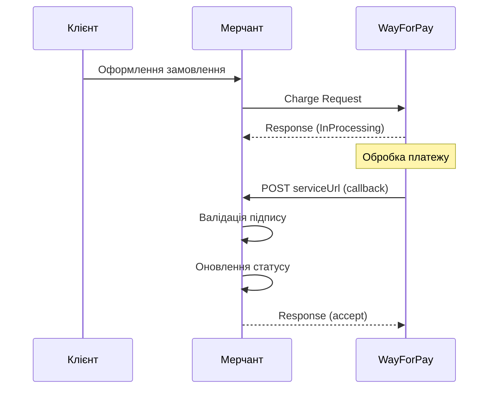

# ADR-009: Webhook Handler Design

## Статус

Proposed

## Контекст

WayForPay надсилає callback (webhook) на `serviceUrl` після обробки платежу. Це асинхронне сповіщення є критичним для:

- Отримання фінального статусу транзакції (Approved, Declined, Refunded тощо)
- Оновлення статусу замовлення у базі даних мерчанта
- Збереження деталей транзакції (authCode, cardPan, fee)
- Отримання recToken для майбутніх рекурентних платежів

### Sequence Diagram (з PRD секція 3.11)



### Структура webhook callback

```json
{
  "merchantAccount": "merchant_test",
  "orderReference": "ORDER123",
  "merchantSignature": "a1b2c3d4e5f6...",
  "amount": 100.00,
  "currency": "UAH",
  "authCode": "123456",
  "cardPan": "411111****1111",
  "transactionStatus": "Approved",
  "reasonCode": 1100,
  "reason": "Ok",
  "fee": 2.50,
  "paymentSystem": "Visa"
}
```

### Очікувана відповідь на webhook

```json
{
  "orderReference": "ORDER123",
  "status": "accept",
  "time": 1704700000,
  "signature": "..."
}
```

WayForPay очікує підписану відповідь. Якщо відповідь не надійде або буде невалідною, WayForPay повторюватиме webhook до 24 годин.

### Вимоги з PRD

| Вимога | Секція PRD | Опис |
|--------|------------|------|
| FR-10 | 3.11 | Webhook Handler з валідацією підпису |
| API | 7.3 | IWebhookHandler інтерфейс |
| Example | 8.5 | Приклад обробки webhook в контролері |
| NFR-06 | 4.6 | Тестованість компонентів |

### Технічні обмеження

- SDK повинен працювати з різними фреймворками (ASP.NET Core, Azure Functions, AWS Lambda)
- Мінімальні залежності в core пакеті
- Підтримка різних способів отримання request body (Stream, string, HttpRequest)
- Валідація підпису з використанням ISignatureGenerator (ADR-002)

## Критерії вибору (Decision Drivers)

- **Framework Independence** — SDK має працювати не лише з ASP.NET Core, але й з Azure Functions, AWS Lambda, Minimal API
- **ASP.NET Core Integration** — зручна інтеграція для найпоширенішого сценарію використання
- **Мінімальні залежності** — core пакет не повинен залежати від ASP.NET Core
- **Тестованість** — легке тестування без запуску HTTP сервера
- **Type Safety** — строго типізовані моделі payload та response
- **Security** — обов'язкова валідація підпису перед обробкою

## Розглянуті варіанти

1. ASP.NET Core specific — залежність від HttpRequest/IActionResult
2. Framework-agnostic — Stream/string вхід, JSON string вихід
3. Dual approach — базовий core + ASP.NET Core extension methods
4. Middleware — окремий пакет WayForPaySDK.AspNetCore з middleware

## Рішення

Обрано **Варіант 3: Dual approach**, тому що цей підхід забезпечує максимальну гнучкість: базовий `IWebhookHandler` працює з примітивними типами (Stream/string), а extension methods для ASP.NET Core надають зручний API для найпоширенішого сценарію. Це дозволяє використовувати SDK у будь-якому фреймворку без зайвих залежностей.

### Варіант 1: ASP.NET Core Specific

```csharp
public interface IWebhookHandler
{
    Task<WebhookPayload> ParseAsync(HttpRequest request);
    IActionResult CreateResponse(WebhookPayload payload, WebhookStatus status);
}

public class WebhookHandler : IWebhookHandler
{
    public async Task<WebhookPayload> ParseAsync(HttpRequest request)
    {
        request.EnableBuffering();
        var body = await new StreamReader(request.Body).ReadToEndAsync();
        // ... parsing logic
    }

    public IActionResult CreateResponse(WebhookPayload payload, WebhookStatus status)
    {
        var response = new WebhookResponse { /* ... */ };
        return new OkObjectResult(response);
    }
}
```

**Переваги:**

- Найзручніший API для ASP.NET Core розробників
- Нативна інтеграція з HttpRequest та IActionResult
- Менше boilerplate коду в контролерах
- Автоматичний доступ до headers, body, form data

**Недоліки:**

- **Жорстка залежність від Microsoft.AspNetCore.Http** — неможливо використати в Azure Functions, AWS Lambda, Console apps
- Порушення принципу framework independence
- Збільшення розміру пакету через ASP.NET Core залежності
- Неможливість використання в serverless середовищах без ASP.NET Core
- Складне тестування — потребує мокування HttpRequest

### Варіант 2: Framework-Agnostic

```csharp
public interface IWebhookHandler
{
    Task<WebhookPayload> ParseAsync(Stream body);
    WebhookPayload Parse(string json);
    string CreateResponse(WebhookPayload payload, WebhookStatus status = WebhookStatus.Accept);
}

public class WebhookHandler : IWebhookHandler
{
    private readonly ISignatureGenerator _signatureGenerator;

    public async Task<WebhookPayload> ParseAsync(Stream body)
    {
        using var reader = new StreamReader(body);
        var json = await reader.ReadToEndAsync();
        return Parse(json);
    }

    public WebhookPayload Parse(string json)
    {
        var payload = JsonSerializer.Deserialize<WebhookPayload>(json);
        ValidateSignature(payload);
        return payload;
    }

    public string CreateResponse(WebhookPayload payload, WebhookStatus status)
    {
        var response = new WebhookResponse
        {
            OrderReference = payload.OrderReference,
            Status = status.ToString().ToLowerInvariant(),
            Time = DateTimeOffset.UtcNow.ToUnixTimeSeconds(),
            Signature = GenerateResponseSignature(payload, status)
        };
        return JsonSerializer.Serialize(response);
    }
}
```

**Переваги:**

- Повна незалежність від фреймворку
- Працює з ASP.NET Core, Azure Functions, AWS Lambda, Console apps
- Мінімальні залежності (лише System.Text.Json)
- Легке unit-тестування з простими string/Stream inputs
- Менший розмір пакету

**Недоліки:**

- Менш зручний API для ASP.NET Core — потрібен додатковий код для роботи з HttpRequest
- Розробники мають самостійно читати Request.Body
- Потрібно вручну встановлювати Content-Type відповіді
- Більше boilerplate в контролерах

### Варіант 3: Dual Approach (Обраний)

```csharp
// Core API (WayForPaySDK)
public interface IWebhookHandler
{
    Task<WebhookPayload> ParseAsync(Stream body, CancellationToken cancellationToken = default);
    WebhookPayload Parse(string json);
    WebhookResponse CreateResponse(WebhookPayload payload, WebhookStatus status = WebhookStatus.Accept);
    string SerializeResponse(WebhookResponse response);
}

// ASP.NET Core Extensions (в тому ж пакеті, але optional)
public static class WebhookHandlerExtensions
{
    public static async Task<WebhookPayload> ParseAsync(
        this IWebhookHandler handler,
        HttpRequest request,
        CancellationToken cancellationToken = default)
    {
        request.EnableBuffering();
        return await handler.ParseAsync(request.Body, cancellationToken);
    }

    public static IActionResult ToActionResult(this WebhookResponse response)
    {
        return new ContentResult
        {
            Content = JsonSerializer.Serialize(response),
            ContentType = "application/json",
            StatusCode = 200
        };
    }
}
```

**Переваги:**

- **Framework independence** — core API працює з Stream/string
- **ASP.NET Core convenience** — extension methods для HttpRequest
- **Гнучкість** — розробник обирає рівень абстракції
- **Мінімальні залежності** — ASP.NET Core types використовуються лише в extensions
- **Легке тестування** — core API тестується без HTTP
- **Backward compatibility** — можна додавати нові extensions без breaking changes

**Недоліки:**

- Два способи використання — може бути конфуз для нових розробників
- Extension methods вимагають using для namespace
- Трохи більше коду в SDK

### Варіант 4: Middleware Package

```csharp
// WayForPaySDK.AspNetCore NuGet package
public class WayForPayWebhookMiddleware
{
    private readonly RequestDelegate _next;
    private readonly IWebhookHandler _handler;

    public async Task InvokeAsync(HttpContext context)
    {
        if (context.Request.Path != "/wayforpay/webhook")
        {
            await _next(context);
            return;
        }

        var payload = await _handler.ParseAsync(context.Request.Body);
        context.Items["WayForPayWebhook"] = payload;
        await _next(context);
    }
}

// Registration
app.UseWayForPayWebhook("/api/payment/callback");
```

**Переваги:**

- Максимальна інтеграція з ASP.NET Core pipeline
- Автоматична обробка на рівні middleware
- Можливість додавання logging, metrics автоматично
- Чітке розділення пакетів

**Недоліки:**

- **Окремий NuGet пакет** — ускладнення версіонування та deployment
- Middleware не підходить для всіх сценаріїв (потрібна гнучкість)
- Складніша конфігурація routing
- Не працює з Azure Functions, AWS Lambda
- Overhead для простих сценаріїв

## Детальний дизайн обраного рішення

### Структура файлів

```
WayForPaySDK/
├── Handlers/
│   ├── IWebhookHandler.cs
│   ├── WebhookHandler.cs
│   ├── WebhookPayload.cs
│   ├── WebhookResponse.cs
│   └── WebhookStatus.cs
├── Extensions/
│   └── WebhookHandlerExtensions.cs    # ASP.NET Core extensions
└── Exceptions/
    └── SignatureException.cs
```

### WebhookPayload Model

```csharp
namespace WayForPaySDK.Handlers;

/// <summary>
/// Payload отриманий від WayForPay через webhook callback.
/// </summary>
public sealed record WebhookPayload
{
    /// <summary>Ідентифікатор мерчанта.</summary>
    public required string MerchantAccount { get; init; }

    /// <summary>Номер замовлення.</summary>
    public required string OrderReference { get; init; }

    /// <summary>Підпис для валідації.</summary>
    public required string MerchantSignature { get; init; }

    /// <summary>Сума транзакції.</summary>
    public required decimal Amount { get; init; }

    /// <summary>Валюта (UAH, USD, EUR).</summary>
    public required string Currency { get; init; }

    /// <summary>Код авторизації банку.</summary>
    public string? AuthCode { get; init; }

    /// <summary>Маска карти (411111****1111).</summary>
    public string? CardPan { get; init; }

    /// <summary>Тип карти (Visa, MasterCard).</summary>
    public string? CardType { get; init; }

    /// <summary>Статус транзакції.</summary>
    public required string TransactionStatus { get; init; }

    /// <summary>Код результату операції.</summary>
    public required int ReasonCode { get; init; }

    /// <summary>Опис результату.</summary>
    public string? Reason { get; init; }

    /// <summary>Комісія.</summary>
    public decimal? Fee { get; init; }

    /// <summary>Платіжна система.</summary>
    public string? PaymentSystem { get; init; }

    /// <summary>Токен для рекурентних платежів.</summary>
    public string? RecToken { get; init; }

    /// <summary>Дата транзакції (Unix timestamp).</summary>
    public long? TransactionDate { get; init; }

    /// <summary>Чи транзакція успішна.</summary>
    public bool IsSuccess => ReasonCode == 1100;

    /// <summary>Чи транзакція схвалена.</summary>
    public bool IsApproved => TransactionStatus == "Approved";
}
```

### WebhookResponse Model

```csharp
namespace WayForPaySDK.Handlers;

/// <summary>
/// Відповідь на webhook callback для WayForPay.
/// </summary>
public sealed record WebhookResponse
{
    /// <summary>Номер замовлення.</summary>
    [JsonPropertyName("orderReference")]
    public required string OrderReference { get; init; }

    /// <summary>Статус обробки (accept/decline).</summary>
    [JsonPropertyName("status")]
    public required string Status { get; init; }

    /// <summary>Час обробки (Unix timestamp).</summary>
    [JsonPropertyName("time")]
    public required long Time { get; init; }

    /// <summary>Підпис відповіді.</summary>
    [JsonPropertyName("signature")]
    public required string Signature { get; init; }
}
```

### WebhookStatus Enum

```csharp
namespace WayForPaySDK.Handlers;

/// <summary>
/// Статус обробки webhook.
/// </summary>
public enum WebhookStatus
{
    /// <summary>Webhook успішно оброблений.</summary>
    Accept,

    /// <summary>Webhook відхилений (помилка обробки).</summary>
    Decline
}
```

### IWebhookHandler Interface

```csharp
namespace WayForPaySDK.Handlers;

/// <summary>
/// Обробник webhook callbacks від WayForPay.
/// </summary>
public interface IWebhookHandler
{
    /// <summary>
    /// Асинхронно парсить та валідує webhook payload зі Stream.
    /// </summary>
    /// <param name="body">Stream з JSON payload.</param>
    /// <param name="cancellationToken">Токен скасування.</param>
    /// <returns>Валідований payload.</returns>
    /// <exception cref="SignatureException">Якщо підпис невалідний.</exception>
    /// <exception cref="JsonException">Якщо JSON невалідний.</exception>
    Task<WebhookPayload> ParseAsync(Stream body, CancellationToken cancellationToken = default);

    /// <summary>
    /// Парсить та валідує webhook payload з JSON string.
    /// </summary>
    /// <param name="json">JSON string з payload.</param>
    /// <returns>Валідований payload.</returns>
    /// <exception cref="SignatureException">Якщо підпис невалідний.</exception>
    /// <exception cref="JsonException">Якщо JSON невалідний.</exception>
    WebhookPayload Parse(string json);

    /// <summary>
    /// Створює підписану відповідь на webhook.
    /// </summary>
    /// <param name="payload">Отриманий payload.</param>
    /// <param name="status">Статус обробки.</param>
    /// <returns>Підписана відповідь.</returns>
    WebhookResponse CreateResponse(WebhookPayload payload, WebhookStatus status = WebhookStatus.Accept);

    /// <summary>
    /// Серіалізує відповідь у JSON string.
    /// </summary>
    /// <param name="response">Відповідь для серіалізації.</param>
    /// <returns>JSON string.</returns>
    string SerializeResponse(WebhookResponse response);
}
```

### WebhookHandler Implementation

```csharp
namespace WayForPaySDK.Handlers;

using System.Globalization;
using System.Text.Json;
using WayForPaySDK.Crypto;
using WayForPaySDK.Exceptions;
using WayForPaySDK.Serialization;

/// <summary>
/// Реалізація обробника webhook callbacks від WayForPay.
/// </summary>
public sealed class WebhookHandler : IWebhookHandler
{
    private readonly ISignatureGenerator _signatureGenerator;

    /// <summary>
    /// Створює новий екземпляр обробника webhook.
    /// </summary>
    /// <param name="signatureGenerator">Генератор підписів.</param>
    public WebhookHandler(ISignatureGenerator signatureGenerator)
    {
        _signatureGenerator = signatureGenerator ?? throw new ArgumentNullException(nameof(signatureGenerator));
    }

    /// <inheritdoc />
    public async Task<WebhookPayload> ParseAsync(Stream body, CancellationToken cancellationToken = default)
    {
        ArgumentNullException.ThrowIfNull(body);

        var payload = await JsonSerializer.DeserializeAsync<WebhookPayload>(
            body,
            WayForPayJsonContext.Default.WebhookPayload,
            cancellationToken)
            ?? throw new JsonException("Failed to deserialize webhook payload");

        ValidateSignature(payload);
        return payload;
    }

    /// <inheritdoc />
    public WebhookPayload Parse(string json)
    {
        ArgumentException.ThrowIfNullOrWhiteSpace(json);

        var payload = JsonSerializer.Deserialize<WebhookPayload>(
            json,
            WayForPayJsonContext.Default.WebhookPayload)
            ?? throw new JsonException("Failed to deserialize webhook payload");

        ValidateSignature(payload);
        return payload;
    }

    /// <inheritdoc />
    public WebhookResponse CreateResponse(WebhookPayload payload, WebhookStatus status = WebhookStatus.Accept)
    {
        ArgumentNullException.ThrowIfNull(payload);

        var time = DateTimeOffset.UtcNow.ToUnixTimeSeconds();
        var statusString = status.ToString().ToLowerInvariant();

        // Поля для підпису відповіді: orderReference;status;time
        var signatureFields = new[]
        {
            payload.OrderReference,
            statusString,
            time.ToString(CultureInfo.InvariantCulture)
        };

        var signature = _signatureGenerator.GenerateSignature(signatureFields);

        return new WebhookResponse
        {
            OrderReference = payload.OrderReference,
            Status = statusString,
            Time = time,
            Signature = signature
        };
    }

    /// <inheritdoc />
    public string SerializeResponse(WebhookResponse response)
    {
        ArgumentNullException.ThrowIfNull(response);

        return JsonSerializer.Serialize(response, WayForPayJsonContext.Default.WebhookResponse);
    }

    private void ValidateSignature(WebhookPayload payload)
    {
        // Поля для валідації підпису callback:
        // merchantAccount;orderReference;amount;currency;authCode;cardPan;transactionStatus;reasonCode
        var signatureFields = new[]
        {
            payload.MerchantAccount,
            payload.OrderReference,
            payload.Amount.ToString("F2", CultureInfo.InvariantCulture),
            payload.Currency,
            payload.AuthCode ?? string.Empty,
            payload.CardPan ?? string.Empty,
            payload.TransactionStatus,
            payload.ReasonCode.ToString(CultureInfo.InvariantCulture)
        };

        var isValid = _signatureGenerator.ValidateSignature(payload.MerchantSignature, signatureFields);

        if (!isValid)
        {
            throw new SignatureException("Invalid webhook signature from WayForPay");
        }
    }
}
```

### ASP.NET Core Extension Methods

```csharp
namespace WayForPaySDK.Extensions;

using System.Text.Json;
using Microsoft.AspNetCore.Http;
using Microsoft.AspNetCore.Mvc;
using WayForPaySDK.Handlers;
using WayForPaySDK.Serialization;

/// <summary>
/// Extension methods для інтеграції IWebhookHandler з ASP.NET Core.
/// </summary>
public static class WebhookHandlerExtensions
{
    /// <summary>
    /// Парсить webhook payload з HttpRequest.
    /// </summary>
    /// <param name="handler">Webhook handler.</param>
    /// <param name="request">HTTP запит.</param>
    /// <param name="cancellationToken">Токен скасування.</param>
    /// <returns>Валідований payload.</returns>
    public static async Task<WebhookPayload> ParseAsync(
        this IWebhookHandler handler,
        HttpRequest request,
        CancellationToken cancellationToken = default)
    {
        ArgumentNullException.ThrowIfNull(handler);
        ArgumentNullException.ThrowIfNull(request);

        // Дозволяємо повторне читання body
        request.EnableBuffering();

        return await handler.ParseAsync(request.Body, cancellationToken);
    }

    /// <summary>
    /// Конвертує WebhookResponse в IActionResult.
    /// </summary>
    /// <param name="response">Webhook відповідь.</param>
    /// <returns>IActionResult для повернення з контролера.</returns>
    public static IActionResult ToActionResult(this WebhookResponse response)
    {
        ArgumentNullException.ThrowIfNull(response);

        return new ContentResult
        {
            Content = JsonSerializer.Serialize(response, WayForPayJsonContext.Default.WebhookResponse),
            ContentType = "application/json",
            StatusCode = StatusCodes.Status200OK
        };
    }

    /// <summary>
    /// Обробляє webhook та повертає IActionResult.
    /// </summary>
    /// <param name="handler">Webhook handler.</param>
    /// <param name="request">HTTP запит.</param>
    /// <param name="processPayload">Функція обробки payload.</param>
    /// <param name="cancellationToken">Токен скасування.</param>
    /// <returns>IActionResult з відповіддю.</returns>
    public static async Task<IActionResult> HandleAsync(
        this IWebhookHandler handler,
        HttpRequest request,
        Func<WebhookPayload, Task> processPayload,
        CancellationToken cancellationToken = default)
    {
        ArgumentNullException.ThrowIfNull(handler);
        ArgumentNullException.ThrowIfNull(request);
        ArgumentNullException.ThrowIfNull(processPayload);

        var payload = await handler.ParseAsync(request, cancellationToken);
        await processPayload(payload);
        var response = handler.CreateResponse(payload, WebhookStatus.Accept);
        return response.ToActionResult();
    }
}
```

### DI Registration

```csharp
namespace WayForPaySDK.Extensions;

public static class ServiceCollectionExtensions
{
    public static IServiceCollection AddWayForPay(
        this IServiceCollection services,
        Action<WayForPayOptions> configure)
    {
        services.Configure(configure);

        // Signature generator (з ADR-002)
        services.AddSingleton<ISignatureGenerator>(sp =>
        {
            var options = sp.GetRequiredService<IOptions<WayForPayOptions>>().Value;
            return new HmacMd5SignatureGenerator(options.MerchantSecretKey);
        });

        // Webhook handler
        services.AddScoped<IWebhookHandler, WebhookHandler>();

        // HTTP client та інші сервіси...

        return services;
    }
}
```

## Приклади використання

### ASP.NET Core Controller (з Extension Methods)

```csharp
[ApiController]
[Route("api/payment")]
public class PaymentWebhookController : ControllerBase
{
    private readonly IWebhookHandler _webhookHandler;
    private readonly IOrderService _orderService;
    private readonly ILogger<PaymentWebhookController> _logger;

    public PaymentWebhookController(
        IWebhookHandler webhookHandler,
        IOrderService orderService,
        ILogger<PaymentWebhookController> logger)
    {
        _webhookHandler = webhookHandler;
        _orderService = orderService;
        _logger = logger;
    }

    [HttpPost("callback")]
    public async Task<IActionResult> HandleWebhook(CancellationToken cancellationToken)
    {
        try
        {
            // Використання extension method для HttpRequest
            var payload = await _webhookHandler.ParseAsync(Request, cancellationToken);

            _logger.LogInformation(
                "Received webhook for order {OrderReference}, status: {Status}",
                payload.OrderReference,
                payload.TransactionStatus);

            // Оновлення статусу замовлення
            await _orderService.UpdateOrderStatusAsync(
                payload.OrderReference,
                payload.TransactionStatus,
                payload.RecToken,
                cancellationToken);

            // Створення підписаної відповіді
            var response = _webhookHandler.CreateResponse(payload, WebhookStatus.Accept);

            // Конвертація в IActionResult через extension method
            return response.ToActionResult();
        }
        catch (SignatureException ex)
        {
            _logger.LogWarning(ex, "Invalid webhook signature");
            return BadRequest("Invalid signature");
        }
        catch (JsonException ex)
        {
            _logger.LogWarning(ex, "Invalid webhook payload");
            return BadRequest("Invalid payload");
        }
    }
}
```

### ASP.NET Core Controller (Спрощений варіант з HandleAsync)

```csharp
[ApiController]
[Route("api/payment")]
public class PaymentWebhookController : ControllerBase
{
    private readonly IWebhookHandler _webhookHandler;
    private readonly IOrderService _orderService;

    [HttpPost("callback")]
    public Task<IActionResult> HandleWebhook(CancellationToken cancellationToken)
    {
        return _webhookHandler.HandleAsync(
            Request,
            async payload =>
            {
                await _orderService.UpdateOrderStatusAsync(
                    payload.OrderReference,
                    payload.TransactionStatus,
                    payload.RecToken,
                    cancellationToken);
            },
            cancellationToken);
    }
}
```

### ASP.NET Core Minimal API

```csharp
var builder = WebApplication.CreateBuilder(args);

builder.Services.AddWayForPay(options =>
{
    options.MerchantAccount = "test_merchant";
    options.MerchantSecretKey = "secret_key";
    options.MerchantDomainName = "example.com";
});

var app = builder.Build();

app.MapPost("/api/webhook", async (
    HttpRequest request,
    IWebhookHandler handler,
    IOrderService orders,
    CancellationToken ct) =>
{
    try
    {
        var payload = await handler.ParseAsync(request, ct);

        await orders.UpdateStatusAsync(
            payload.OrderReference,
            payload.TransactionStatus,
            ct);

        return handler.CreateResponse(payload).ToActionResult();
    }
    catch (SignatureException)
    {
        return Results.BadRequest("Invalid signature");
    }
});

app.Run();
```

### Azure Functions (Framework-Agnostic API)

```csharp
public class PaymentWebhookFunction
{
    private readonly IWebhookHandler _webhookHandler;
    private readonly IOrderService _orderService;

    public PaymentWebhookFunction(
        IWebhookHandler webhookHandler,
        IOrderService orderService)
    {
        _webhookHandler = webhookHandler;
        _orderService = orderService;
    }

    [Function("PaymentWebhook")]
    public async Task<HttpResponseData> Run(
        [HttpTrigger(AuthorizationLevel.Anonymous, "post", Route = "payment/callback")]
        HttpRequestData request,
        CancellationToken cancellationToken)
    {
        try
        {
            // Використання базового API зі Stream
            var payload = await _webhookHandler.ParseAsync(request.Body, cancellationToken);

            await _orderService.UpdateOrderStatusAsync(
                payload.OrderReference,
                payload.TransactionStatus,
                cancellationToken);

            var webhookResponse = _webhookHandler.CreateResponse(payload, WebhookStatus.Accept);

            var response = request.CreateResponse(HttpStatusCode.OK);
            response.Headers.Add("Content-Type", "application/json");
            await response.WriteStringAsync(_webhookHandler.SerializeResponse(webhookResponse));

            return response;
        }
        catch (SignatureException)
        {
            var response = request.CreateResponse(HttpStatusCode.BadRequest);
            await response.WriteStringAsync("Invalid signature");
            return response;
        }
    }
}
```

### AWS Lambda (Framework-Agnostic API)

```csharp
public class PaymentWebhookHandler
{
    private readonly IWebhookHandler _webhookHandler;
    private readonly IOrderService _orderService;

    public async Task<APIGatewayProxyResponse> HandleWebhook(
        APIGatewayProxyRequest request,
        ILambdaContext context)
    {
        try
        {
            // Використання базового API з string
            var payload = _webhookHandler.Parse(request.Body);

            await _orderService.UpdateOrderStatusAsync(
                payload.OrderReference,
                payload.TransactionStatus);

            var webhookResponse = _webhookHandler.CreateResponse(payload, WebhookStatus.Accept);

            return new APIGatewayProxyResponse
            {
                StatusCode = 200,
                Headers = new Dictionary<string, string>
                {
                    { "Content-Type", "application/json" }
                },
                Body = _webhookHandler.SerializeResponse(webhookResponse)
            };
        }
        catch (SignatureException)
        {
            return new APIGatewayProxyResponse
            {
                StatusCode = 400,
                Body = "Invalid signature"
            };
        }
    }
}
```

### Unit Test

```csharp
public class WebhookHandlerTests
{
    private const string TestSecretKey = "test_secret_key";

    [Fact]
    public void Parse_WithValidPayload_ReturnsPayload()
    {
        // Arrange
        var signatureGenerator = new HmacMd5SignatureGenerator(TestSecretKey);
        var handler = new WebhookHandler(signatureGenerator);

        var expectedSignature = signatureGenerator.GenerateSignature(new[]
        {
            "test_merchant",
            "ORDER123",
            "100.00",
            "UAH",
            "123456",
            "411111****1111",
            "Approved",
            "1100"
        });

        var json = $$"""
        {
            "merchantAccount": "test_merchant",
            "orderReference": "ORDER123",
            "merchantSignature": "{{expectedSignature}}",
            "amount": 100.00,
            "currency": "UAH",
            "authCode": "123456",
            "cardPan": "411111****1111",
            "transactionStatus": "Approved",
            "reasonCode": 1100
        }
        """;

        // Act
        var payload = handler.Parse(json);

        // Assert
        payload.OrderReference.Should().Be("ORDER123");
        payload.TransactionStatus.Should().Be("Approved");
        payload.IsSuccess.Should().BeTrue();
        payload.IsApproved.Should().BeTrue();
    }

    [Fact]
    public void Parse_WithInvalidSignature_ThrowsSignatureException()
    {
        // Arrange
        var signatureGenerator = new HmacMd5SignatureGenerator(TestSecretKey);
        var handler = new WebhookHandler(signatureGenerator);

        var json = """
        {
            "merchantAccount": "test_merchant",
            "orderReference": "ORDER123",
            "merchantSignature": "invalid_signature",
            "amount": 100.00,
            "currency": "UAH",
            "transactionStatus": "Approved",
            "reasonCode": 1100
        }
        """;

        // Act & Assert
        var act = () => handler.Parse(json);
        act.Should().Throw<SignatureException>();
    }

    [Fact]
    public void CreateResponse_ReturnsSignedResponse()
    {
        // Arrange
        var signatureGenerator = new HmacMd5SignatureGenerator(TestSecretKey);
        var handler = new WebhookHandler(signatureGenerator);

        var payload = new WebhookPayload
        {
            MerchantAccount = "test_merchant",
            OrderReference = "ORDER123",
            MerchantSignature = "...",
            Amount = 100.00m,
            Currency = "UAH",
            TransactionStatus = "Approved",
            ReasonCode = 1100
        };

        // Act
        var response = handler.CreateResponse(payload, WebhookStatus.Accept);

        // Assert
        response.OrderReference.Should().Be("ORDER123");
        response.Status.Should().Be("accept");
        response.Time.Should().BeGreaterThan(0);
        response.Signature.Should().NotBeNullOrEmpty();
    }
}
```

## Наслідки

### Позитивні

- **Framework Independence** — базовий API працює з будь-яким фреймворком (ASP.NET Core, Azure Functions, AWS Lambda, Console)
- **ASP.NET Core Convenience** — extension methods надають зручний API для найпоширенішого сценарію
- **Testability** — легке unit-тестування з простими string/Stream inputs без HTTP
- **Security** — обов'язкова валідація підпису перед поверненням payload
- **Type Safety** — строго типізовані WebhookPayload та WebhookResponse моделі
- **Separation of Concerns** — IWebhookHandler відповідає лише за parsing/validation/response creation
- **Flexibility** — розробники можуть обрати рівень абстракції відповідно до потреб

### Негативні

- **Two APIs** — наявність двох способів використання може бути конфузом для нових розробників
- **Extra using** — ASP.NET Core extensions вимагають `using WayForPaySDK.Extensions`
- **Conditional compilation** — ASP.NET Core types можуть вимагати `#if` директив або окремої збірки

### Нейтральні

- **IWebhookHandler lifetime** — Scoped lifetime в DI (новий екземпляр на кожен request)
- **JSON serialization** — використовує System.Text.Json source generators (з ADR-005)
- **Signature validation** — делегується до ISignatureGenerator (з ADR-002)

## Порівняльна таблиця

| Критерій | ASP.NET Specific | Framework-Agnostic | Dual Approach | Middleware |
|----------|------------------|--------------------| --------------|------------|
| Framework Independence | :x: | :white_check_mark: | :white_check_mark: | :x: |
| ASP.NET Core Convenience | :white_check_mark: | :x: | :white_check_mark: | :white_check_mark: |
| Azure Functions Support | :x: | :white_check_mark: | :white_check_mark: | :x: |
| AWS Lambda Support | :x: | :white_check_mark: | :white_check_mark: | :x: |
| Minimal Dependencies | :x: | :white_check_mark: | :white_check_mark: | :x: |
| Easy Testing | :x: | :white_check_mark: | :white_check_mark: | :x: |
| Single Package | :white_check_mark: | :white_check_mark: | :white_check_mark: | :x: |
| Simple API | :white_check_mark: | :white_check_mark: | :warning: | :white_check_mark: |

## Посилання

- [PRD](../PRD.md) — секція 3.11 FR-10, секція 7.3, секція 8.5
- [ADR-002](ADR-002-signature-generation.md) — Signature Generation (ISignatureGenerator)
- [ADR-005](ADR-005-json-serialization.md) — JSON Serialization
- [WayForPay API Documentation](https://wiki.wayforpay.com/) — ServiceUrl callback
- [Microsoft Docs: HttpRequest.EnableBuffering](https://learn.microsoft.com/en-us/dotnet/api/microsoft.aspnetcore.http.httprequestrewindextensions.enablebuffering)

## Примітки

- WayForPay повторює webhook запити до 24 годин, якщо не отримує валідну відповідь
- Підпис відповіді генерується з полів: orderReference, status, time
- Час відповіді (time) має бути Unix timestamp в секундах
- Для production рекомендується додати idempotency check для уникнення подвійної обробки webhook
- Extension methods для ASP.NET Core мають умовну компіляцію через `#if` або multi-target framework
